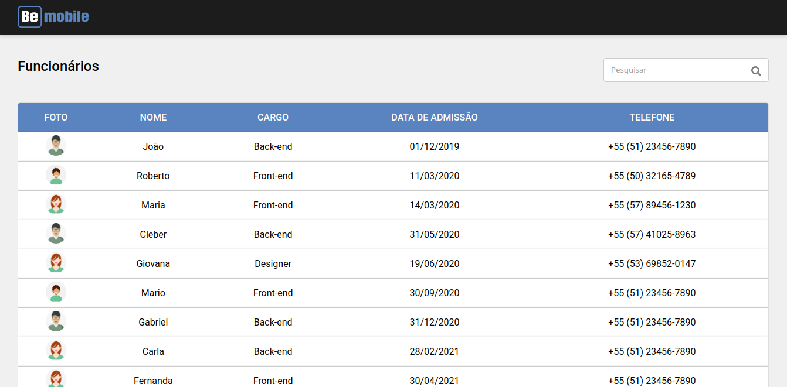

<h1 align="center">Front Table</h1>

<p align="center">
    
</p>

<br>

## 🧪 Tecnologias

Esse projeto foi desenvolvido com as seguintes tecnologias:

- [Next](https://nextjs.org/)
- [Storybook](https://storybook.js.org/)
- [Jest](https://jestjs.io/)
- [Styled components](https://styled-components.com/)
- [JSON Server](https://github.com/typicode/json-server)

## ⚙️ Pré-requisitos
Tenha instalado em sua máquina as seguintes ferramentas:
[Git](https://git-scm.com), [Node.js](https://nodejs.org/en/) e [Yarn](https://yarnpkg.com/).

## 🚀 Como executar

Clone o projeto e acesse a pasta do mesmo.

```bash
$ git clone https://github.com/morricedev/front-table-nextjs.git
$ cd front-table-nextjs
```

Para iniciá-lo, siga os passos abaixo:

```bash
# Instalar as dependências
$ yarn

# Iniciar o json-server
$ yarn server

# Iniciar o projeto
$ yarn dev
```

O app estará disponível no seu browser pelo endereço http://localhost:3000 e a api pelo endereço http://localhost:8080.

## 💻 Sobre o projeto

O projeto é um site simples que lista as informações - que virão por uma API simulada escrita em json-server - dos funcionários de uma empresa e filtra-os através de um campo de pesquisa.

---

Feito com 💜 by Morrice 👋🏻
